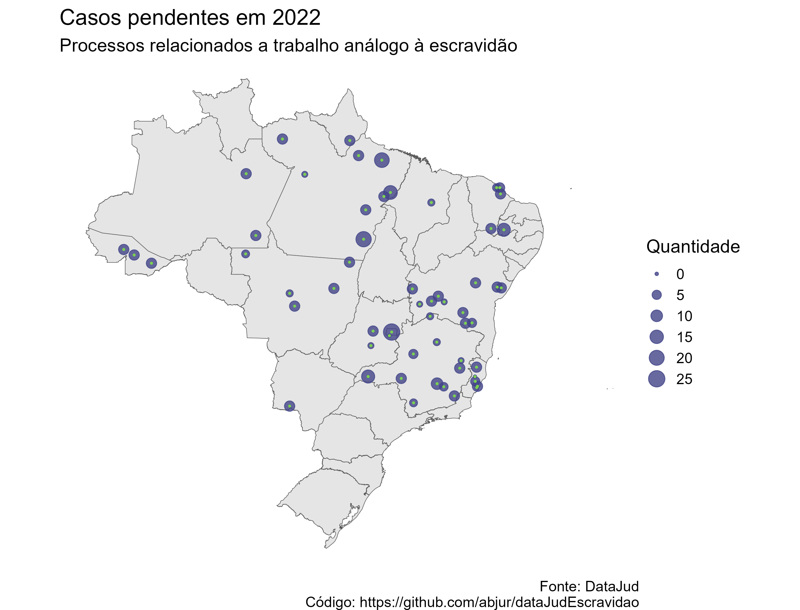

# dataJudEscravidao

<!-- badges: start -->
<!-- badges: end -->

Repositório para armazenar dados utilizados para gerar o gráfico sobre processos relacionados a trabalho análogo à escravidão, utilizando dados do DataJud.

## Licença

MIT
